# Informe de Configuración de CI/CD con Docker y GitHub Actions

## Introducción

Este informe detalla el proceso que se ha seguido para realizar la Actividad 2

## Ubicación del proyecto desarrollado

- **GitHub**: https://github.com/diegosqa/devops_practice

## Desarrollo

### Iniciando el proyecto
Antes de iniciar con el proyecto vamos a proceder a crear el la carpeta *devops-practice* e instalaremos todas las dependencias que vamos a necesitar

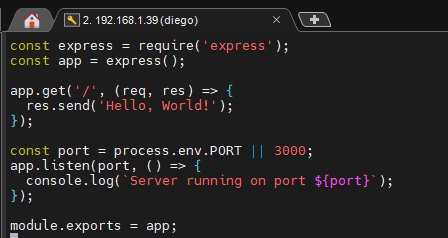

Procedemos a crear todo lo necesario para iniciar nuestro proyecto como las carpetas y el npm init-y

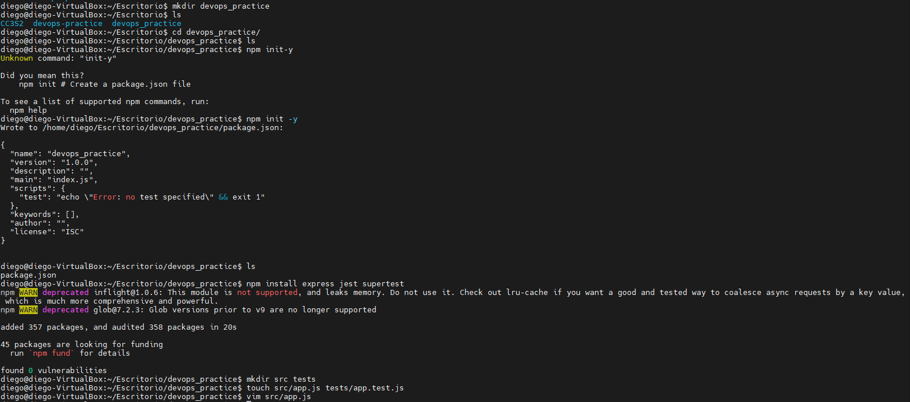

Creamos la clase *src/test.app.js*

Editamos el archivo *package.json*

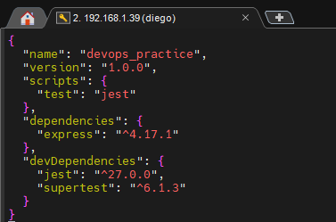

### Realizando las verificaciones para que corran las pruebas

Antes iniciar con lo que sigue del proyecto vamos a continuar ejecutando *npm test* para verificar que las pruebas se esten ejecutando con exito

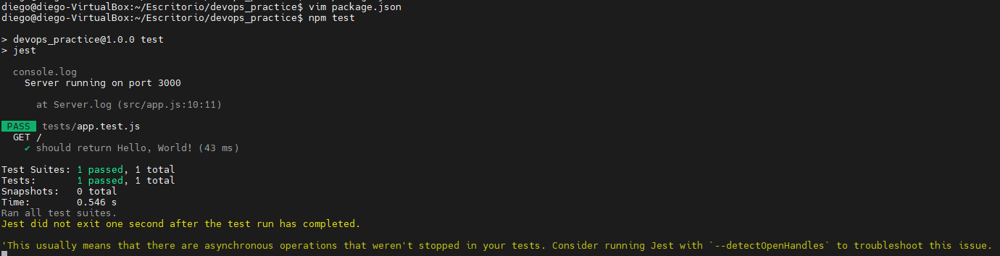

Asimismo vamos a correr el npm *audit* para verificar que no hay ningún problema de seguridad 

### CI Pipeline - Descripción

Este workflow de GitHub Actions automatiza pruebas para un proyecto Node.js.

Luego de esto vamos a editar el workflow para validar que se ejecute correctamente el pipeline, en el cual van a correr tanto los test como la auditoria

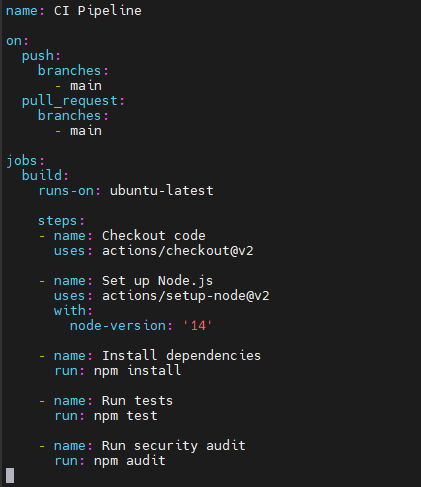

Luego vamos a crear nuestra imagen de docker antes de construir nuestro contenedor

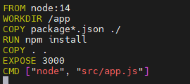

Posteriormente vamos a crear nuestro contenedor para que todo salga bien 

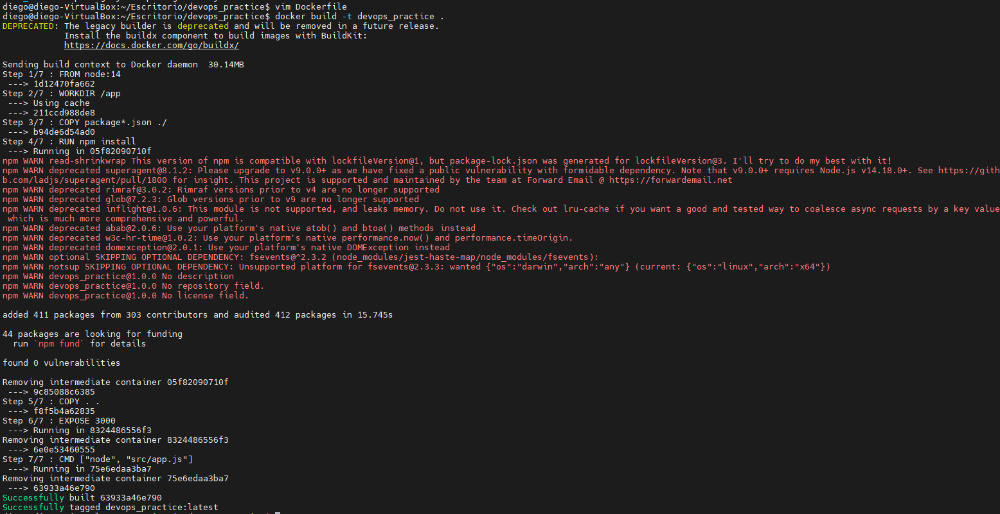

En este punto vamos a lanzar correr el contenedor para validar que realmente este escuchando por el puerto 3000

Entonces procedemos a validar que realmente se pueda mostrar el Hello World en nuestro navegador

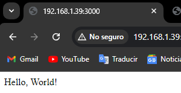

En este punto vamos a crear nuestro *docker-compose.yml* orquestar todo

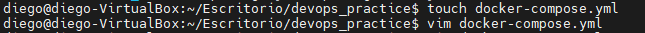

Editamos nuestro *docker-compose.yml*

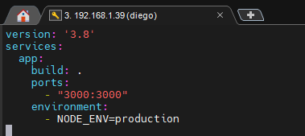

Corremos nuestro docker compose

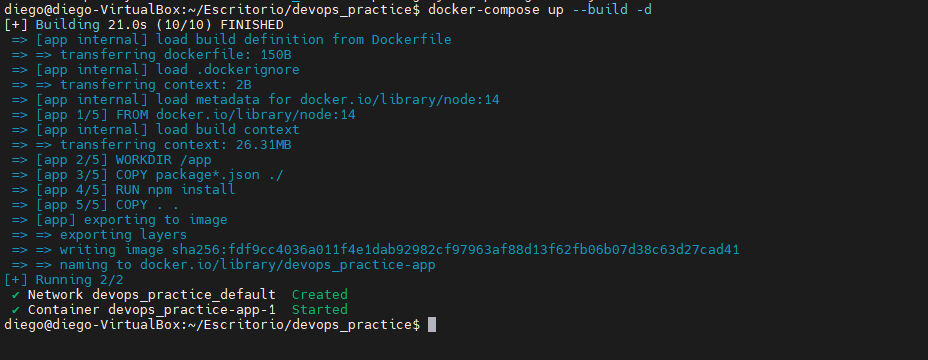

### Observabilidad

Crearemos nuestro *prometheus.yml*

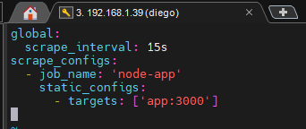

Actualizamos nuestro docker compose para incluir grafana

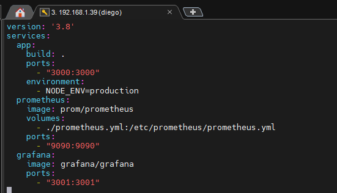

Verificamos que todo este bien, verificamos en el puerto 9090 que prometheus este corriendo

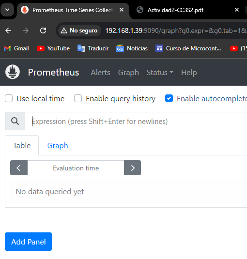

Asimismo verificamos en el puerto 3001 que se encuentre corriendo grafana para ver las métricas

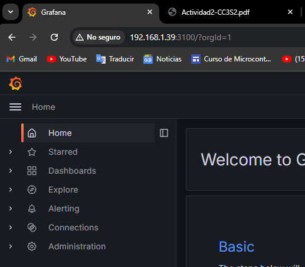

Hacemos un push a la main para correr el proceso y nos sale el siguiente mensaje

