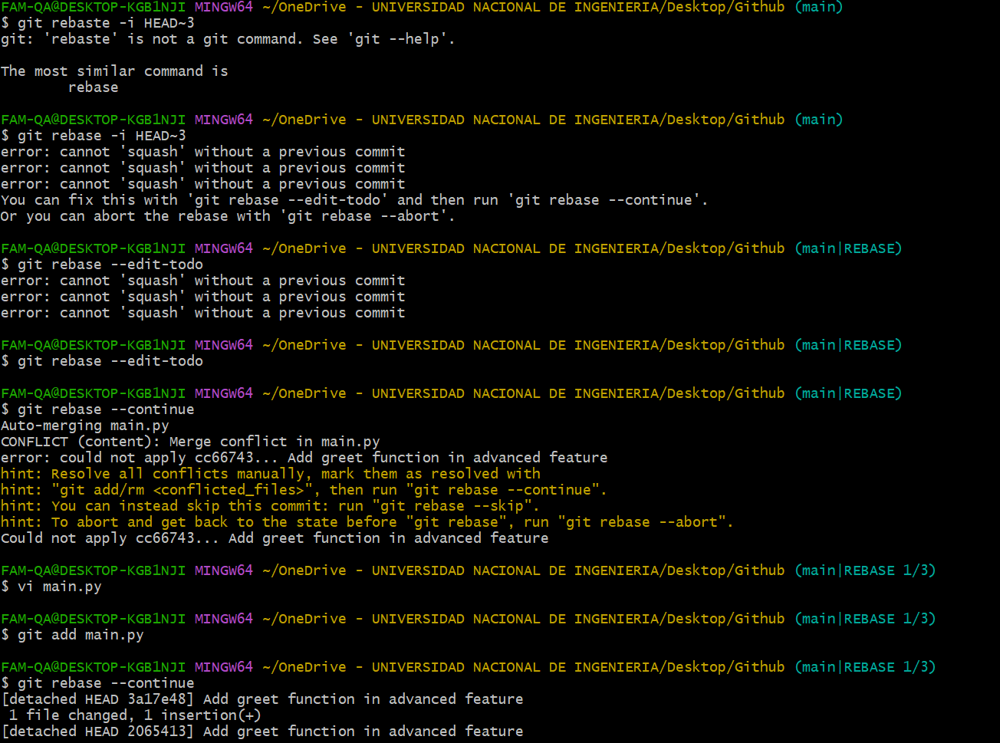
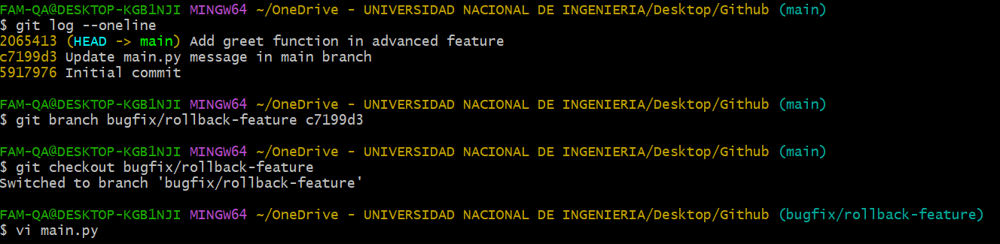

# Practicando Github

## Introducción

Este informe detalla el proceso que se ha seguido para realizar la Actividad 3

## Desarrollo

### Ejercicio 1
Iniciamos el repo, cambiamos el nombre de la rama main a main, creamos el archivo main.py y lo editamos

Agregamos lo siguiente al archivo

Luego vamos añadir estos cambios a la rama main, commiteamos y lo dejamos en el stage, luego procedemos a crear una nueva rama donde vamos a dirigirnos para editar el main.py

Editamos el main.py en la rama feature/advanced-feature

De igual manera añadimos esto a la rama, y commiteamos para dejarlo en el stage

Cambiamos a la rama main para editar el archivo main.py, ya que queremos crear un conflicto 

Lo editamos de la siguiente manera

Añadimos estos cambios a la rama main.py, y commiteamos
Luego verificamos que ocurre un error ya que hay conflicto entre ambas ramas

Al revisar el archivo verificamos lo siguiente

Editamos el archivo para que no cause un conflicto, una de las soluciones es lo siguiente

Como nos damos cuenta, estamos en la rama main | merging, por lo que debemos añadir este cambio para poder resolver el conflicto. Luego de hacer commit verificamos que efectivamente se pudo realziar el merge

Ahora haremos el comando git -log

A continuación un breve resumen de lo que se realizo

**commit 718616ffb39e1b34c0507ce797214d12d079bef**
Se resolvió el conflicto al intentar hacer el merge entre la rama main y la rama feature/advanced-feature.
    El archivo resultante contiene ambos mensajes: "Hello World - updated in main" y "Hello from advanced feature".
**commit c7199d34bcae2e8cd1b79a627e3330660246e27c**
En este commit, se actualizó el mensaje del archivo main.py en la rama main.
    El mensaje se cambió de "Hello from initial main" a "Hello World - updated in main".
**commit cc66743b564dfc7778c0c806d8bc194f3affaab**
En este commit, se modificó el archivo main.py en la rama feature/advanced-feature.
    El mensaje original fue cambiado de "Hello from initial main" a "Hello from advanced feature".
**commit 591797610f1876db9c921685706ce3b86f0f29cb**
En este commit inicial, se creó el archivo main.py con el mensaje "Hello from initial main".

Ahora hacemos el *git log --author="Diego Quispe"* para ver mis commits

### Ejercicio 2
Antes de hacer un *revert* vamos a editar el archivo main.py

Luego de añadirlo con el git add y commit, vamos a ver el status para ver que no hay nada pendiente, luego de eso veremos el git log --online para observar el ultimo commit que se hizo y como esta el HEAD. Como vemos se hizo posible el git revert HEAD
y aparece como Revert. 

Luego de eso vamos hacer un rebaste, editamos el archivo para que todo apunte el cc66743

Aca vemos como tuve algunos problemas de conflictos, pero se pudo resolver 

Finalmente vemos que si se pudo juntar todo y apuntando al que queriamos que en este caso es el commit de Add greet function in advanced feature

Aca verificamos que tenemos ya todo mas ordenado y la ventaja es que podemos eliminar algunos commits luego de hacer un gran cambio, para poder trabajar de manera correcta.

### Ejercicio 3
Vamos hacer a crear una rama *bugfix/rollback-feature* a partir de nuestro primer commit

Vamos a editar el main.py en la nueva rama con lo siguiente:

Luego de eso agregamos haciendo un add. , luego un commit para posterior a eso cambiar a la rama main y hacer un merge. Como vemos hay conflicto, entonces procedemos a editar el main

Editamos el archivo de la siguiente manera

Finalmente resolvemos el conflicto y vemos como se encuentra nuestro repositorio con respecto a los logs, ahi podemos ver un poco mas del historial

Finalmente eliminamos la rama que hemos creado

### Ejercicio 4
En este caso vamos a editar nuestro main con lo siguiente

Agregamos estos cambios para tenerlos en el HEAD, luego de eso hacer un --hard HEAD-1 para volver al anterior y deshacer lo que hicimos

Al visualizar nuevamente vemos que no se origino ningún cambio y volvio al estado anterior

Otra manera de hacer esto ( esto son para los cambios que solo esta en un add., si ya han sido commiteados lo mejor es usar lo que esta arriba)
Vemos que el status es que ha sido modificado el main.py, entonces para deshacer esto solo hacemos un restore para omitir todos los cambios que estan en el stage

Como vemos volvio a la normalidad si ningún cambio

### Ejercicio 5

### Ejercicio 6

