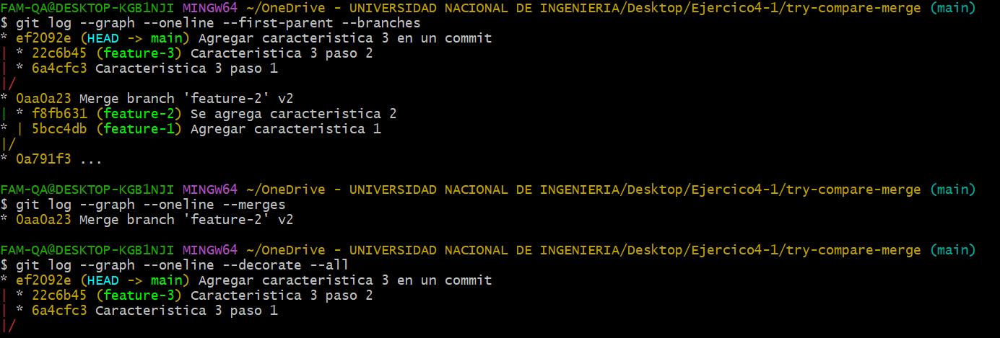
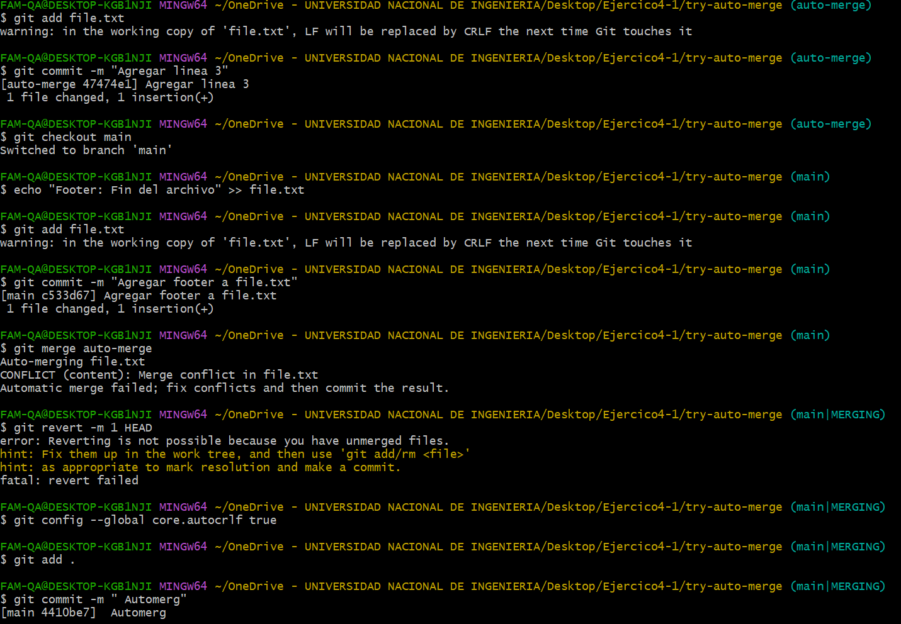

# Practicando Github

## Introducción

Este informe detalla el proceso que se ha seguido para realizar la Actividad 4

## Desarrollo

### Ejercicio try-fast-forward-merge

### Ejercicio try-no-fast-forward-merge

### Ejercicio try-squash-merge

### Resolver conflictor en una fusión non-fast-forward

**¿Qué pasos adicionales tuviste que tomar para resolver el conflicto?**
**¿Qué estrategias podrías emplear para evitar conflictos en futuros desarrollos colaborativos?**
Para resolver el conflicto, edité manualmente el archivo eliminando las marcas de conflicto (<<<<<<<, =======, >>>>>>>), luego agregué el archivo corregido con git add y completé el commit de fusión. Para evitar conflictos en el futuro, es recomendable hacer commits frecuentes, sincronizar ramas regularmente, comunicar cambios con el equipo y usar ramas pequeñas y específicas para nuevas funcionalidades.

### Comparar los historiales con git log despues de diferentes fusiones

**¿Cómo se ve el historial en cada tipo de fusión?**
- Fast-forward: El historial es lineal, y no hay un commit de merge explícito. Parece como si la rama feature-1 hubiera sido parte de la rama principal desde el principio.
- Non-fast-forward: El historial muestra un commit de merge explícito, indicando que feature-2 fue una rama independiente que se fusionó con la rama principal.
- Squash: La fusión de feature-3 aparece como un único commit que combina todos los cambios de la rama, pero no se conserva el historial de commits individuales de esa rama.

**¿Qué método prefieres en diferentes escenarios y por qué?**

- Prefiero fast-forward para fusiones de pequeñas características que no requieren un historial explícito y donde se busca mantener un historial más limpio y lineal.
- Uso non-fast-forward cuando quiero preservar el hecho de que una rama fue trabajada de manera independiente, como en el caso de grandes funcionalidades o en ramas a largo plazo.
- Prefiero squash cuando quiero fusionar múltiples commits de una característica sin llenar el historial con commits pequeños e intermedios, especialmente en ramas con muchos commits pequeños.

### Usando fusiones automáticas y revertir fusiones

**¿Cuándo usarías un comando como git revert para deshacer una fusión?**
Usaría git revert para deshacer una fusión cuando la fusión se realizó por error o se decidió que los cambios fusionados no eran los correctos. A diferencia de git reset, git revert mantiene el historial del repositorio intacto al crear un commit inverso, lo que es más seguro en entornos colaborativos.

**¿Qué tan útil es la función de fusión automática en Git?**

La fusión automática en Git es extremadamente útil porque agiliza el proceso de integración de cambios cuando no hay conflictos, permitiendo que los desarrolladores combinen ramas de manera rápida sin intervención manual. Sin embargo, en proyectos más grandes, siempre es recomendable revisar los cambios después de la fusión para asegurarse de que todo esté como se espera.