# Ejercicio Completo de Git: `git rebase`, `git cherry-pick` y Flujo de Trabajo Scrum

## Parte 1: Git rebase para mantener un historial lineal

### Introducción a `git rebase`
`git rebase` mueve tus commits a una nueva base, lo que resulta en un historial limpio y lineal. Es útil para evitar commits de fusión y hacer más claro el historial del proyecto.

### Paso 1: Crear un nuevo repositorio con dos ramas (`main` y `new-feature`)

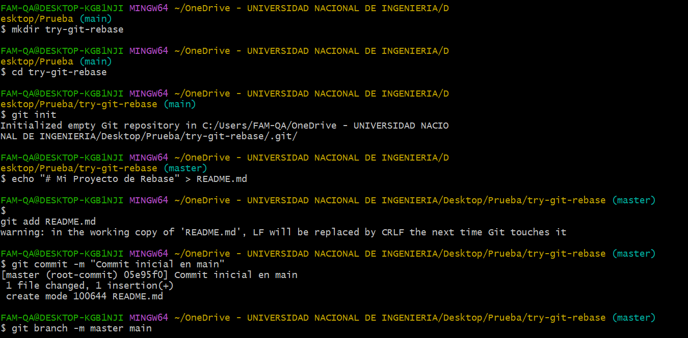
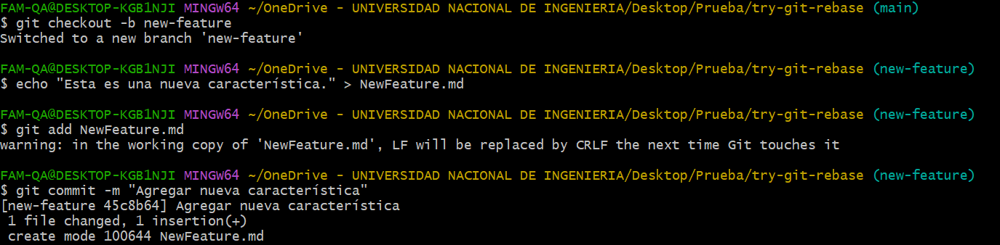

### Paso 2: Simular cambios en la rama `main`

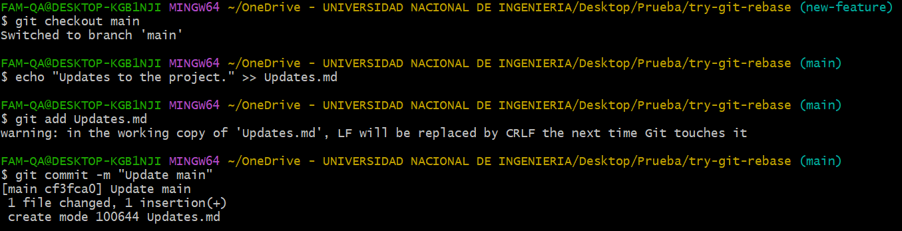

### Paso 3: Realizar el rebase de `new-feature` sobre `main`

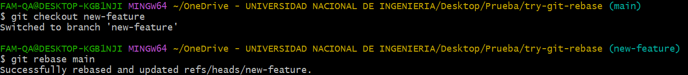

### Paso 4: Verificar el historial de commits

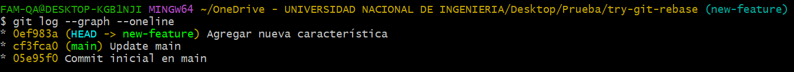

### Paso 5: Fusionar la rama `new-feature` en `main`

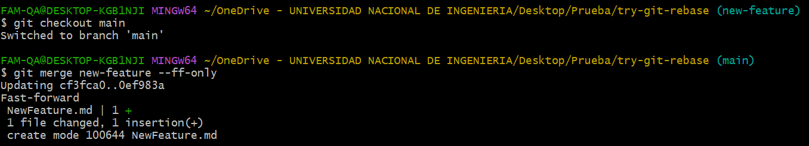

---

## Parte 2: Git cherry-pick para la integración selectiva de commits

### Introducción a `git cherry-pick`
`git cherry-pick` permite aplicar un commit específico de una rama a otra sin hacer un merge completo. Esto es útil cuando solo se desean mover cambios específicos.

### Paso 1: Crear un nuevo repositorio y hacer commits en `add-base-documents`

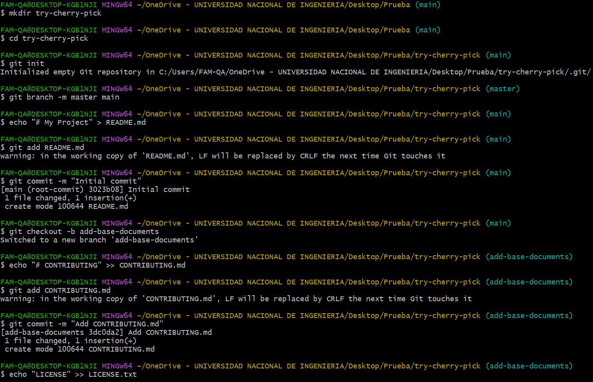
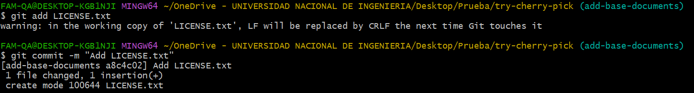

### Paso 2: Hacer cherry-pick de un commit de `add-base-documents` a `main`

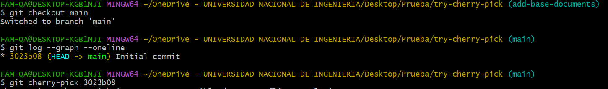

---

## Parte 3: Preguntas teóricas y discusión

### Preguntas de discusión teóricas

1. **¿Por qué se considera que `git rebase` es más útil para mantener un historial de proyecto lineal en comparación con `git merge`?**
   - Git rebase permite que el historial sea más fácil de leer y seguir, al eliminar los "commits de merge". Esto hace que el historial de commits se vea más claro y se mantenga lineal. En entornos de colaboración, un historial lineal facilita la revisión del código y evita que los cambios divergentes compliquen el historial.

2. **¿Qué problemas potenciales podrían surgir si haces `rebase` en una rama compartida con otros miembros del equipo?**
   - Reescribir la historia de una rama compartida puede crear conflictos para otros colaboradores. Si un rebase altera los commits ya publicados, otros desarrolladores podrían tener problemas para sincronizarse con esos cambios y enfrentar conflictos.

3. **¿En qué se diferencia `cherry-pick` de `merge`, y en qué situaciones preferirías uno sobre el otro?**
   - `git cherry-pick` selecciona y aplica un commit específico en otra rama sin incluir todo el historial. `merge`, en cambio, combina todo el historial de dos ramas. Usar `cherry-pick` es ideal cuando solo necesitas unos cambios específicos y no todo el contenido de una rama. 

4. **¿Por qué es importante evitar hacer `rebase` en ramas públicas?**
   - Hacer `rebase` en ramas públicas puede provocar problemas de sincronización para otros desarrolladores que ya hayan basado su trabajo en esos commits. El rebase reescribe el historial, y cualquier persona que haya clonado el repositorio enfrentará conflictos al intentar fusionar sus cambios con la nueva historia.

---

## Parte 4: Simulación de un flujo de trabajo Scrum con `git rebase` y `git merge`

### Instrucciones:

#### Paso 1: Crear un repositorio y hacer commits en `main`:

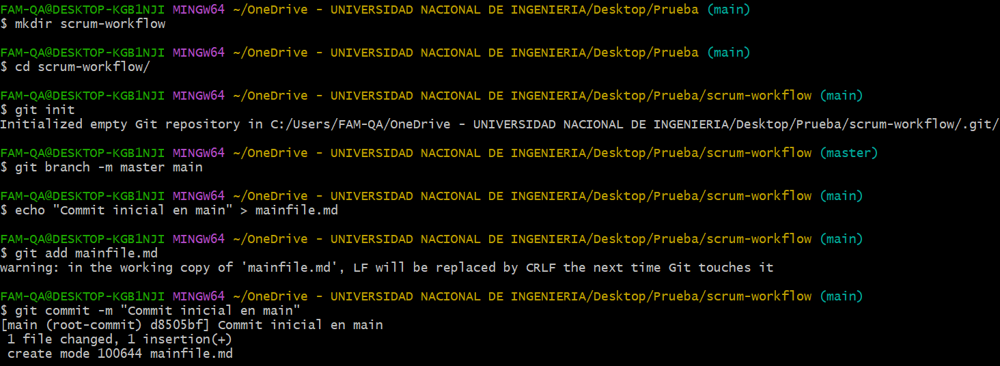

#### Paso 2: Crear una rama `feature` y hacer commits adicionales:

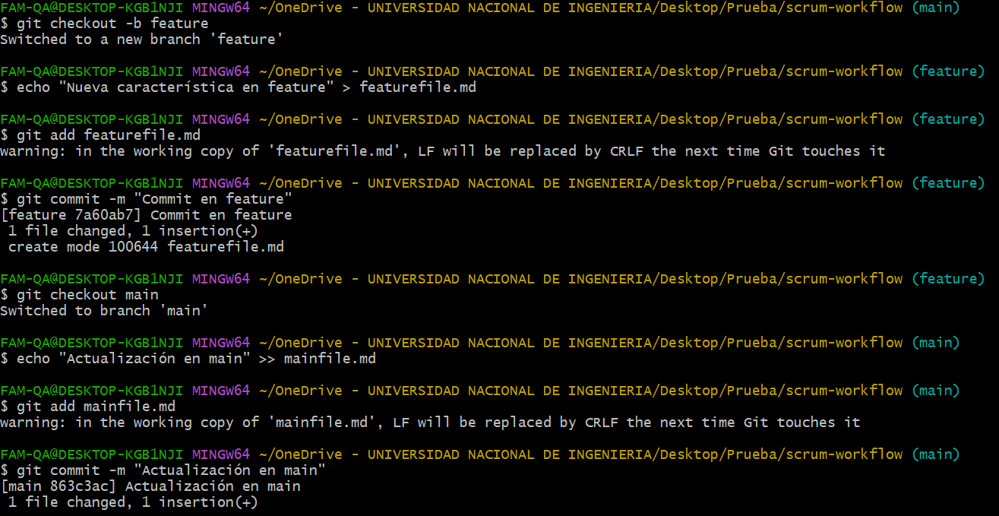

#### Paso 3: Realizar un rebase de `feature` sobre `main`:

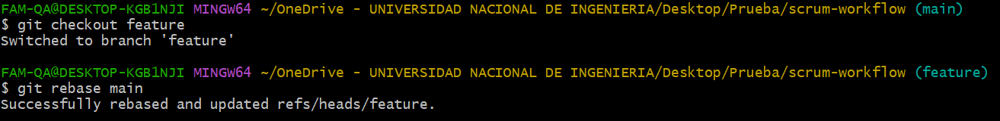

#### Paso 4: Realizar una fusión fast-forward de `feature` con `main`:

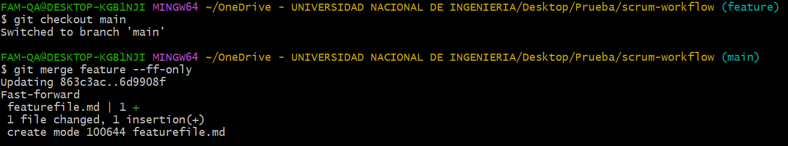

**Preguntas:**

- **¿Qué sucede con el historial de commits después del rebase?**
   - El historial de commits queda lineal, como si los cambios de `feature` siempre hubieran formado parte de `main` desde el principio. No hay un commit de fusión, y los commits de `feature` ahora aparecen encima de los de `main`.

- **¿En qué situación aplicarías una fusión fast-forward en un proyecto ágil?**
   - La fusión fast-forward es ideal cuando el historial de la rama de destino no ha cambiado desde que se creó la rama de funcionalidad, ya que esto permite una integración rápida y sin conflictos.

---

## Parte 5: Cherry-pick para integración selectiva en un pipeline CI/CD

### Instrucciones:

#### Paso 1: Crear un repositorio con una rama `main` y una rama `feature`:

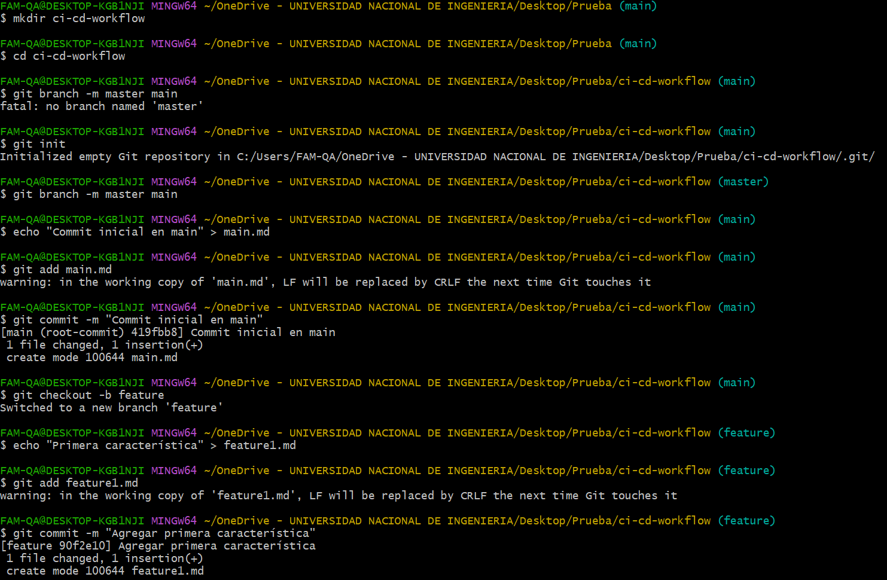
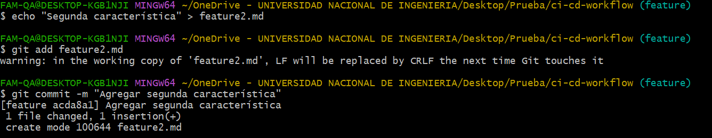

#### Paso 2: Seleccionar y hacer cherry-pick de uno o dos commits listos para producción:

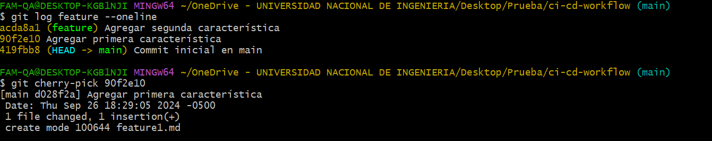

#### Paso 3: Verificar que los commits cherry-picked aparezcan en `main`:

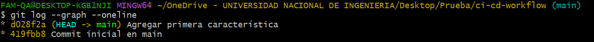

**Preguntas:**

- **¿Cómo utilizarías `cherry-pick` en un pipeline de CI/CD para mover solo ciertos cambios listos a producción?**
   - `git cherry-pick` permite seleccionar commits específicos que están listos para producción sin necesidad de fusionar toda una rama en desarrollo. Esto es útil en CI/CD, donde solo se despliegan características finalizadas mientras el resto aún puede estar en desarrollo.

- **¿Qué ventajas ofrece `cherry-pick` en un flujo de trabajo de DevOps?**
   - Ofrece flexibilidad al permitir que solo los cambios aprobados se integren en la rama de producción, mientras que otros cambios que aún no están listos permanecen fuera. Esto facilita la implementación continua sin interrupciones.

### Preguntas:

- **¿Cómo utilizarías `cherry-pick` en un pipeline de CI/CD para mover solo ciertos cambios listos a producción?**
   - `git cherry-pick` permite seleccionar commits específicos que están listos para producción sin necesidad de fusionar toda una rama en desarrollo. Esto es útil en CI/CD, donde solo se despliegan características finalizadas mientras el resto aún puede estar en desarrollo.

- **¿Qué ventajas ofrece `cherry-pick` en un flujo de trabajo de DevOps?**
   - Ofrece flexibilidad al permitir que solo los cambios aprobados se integren en la rama de producción, mientras que otros cambios que aún no están listos permanecen fuera. Esto facilita la implementación continua sin interrupciones.
