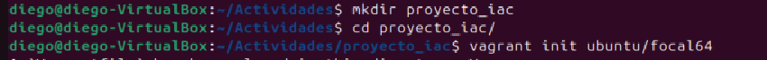
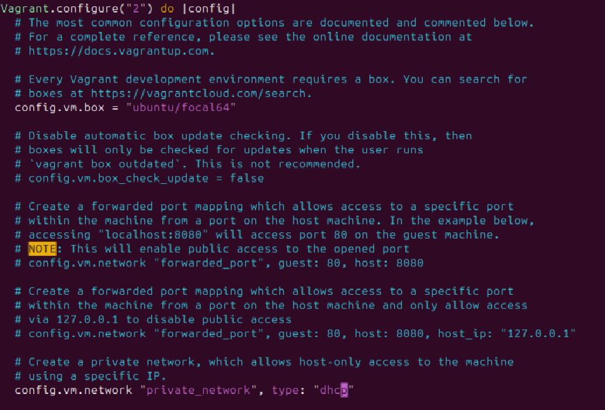

# Informe de Actividad 19
Para esta actividad he logrado ya instalar tanto le vagrant como el ansible, todo lo estoy corriendo desde Window

Para poder correr el Ansible lo hago desde el wsl y para el Vagrant lo hago desde el Powershell

Aca vamos a comenzar creando la carpeta e iniciando el proyecto

Aca le vamos agregar las configuraciones en el VagrantFile

Aca continuamos con las configuraciones en el VagrantFile

En este apartado vamos a crear el playbook.yml en el mismo directorio del contenido

Finalmente vamos a levantar la maquina

Como vemos se ha podido levantar de manera correcta

Por ultimo vamos a comprobar que se pueda ingresar usando vagrant ssh a la maquina virtual levantada y que los paquetes se instalaron

