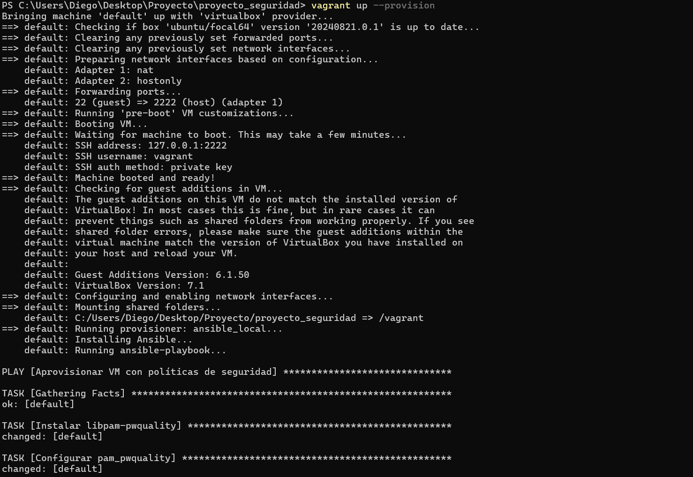
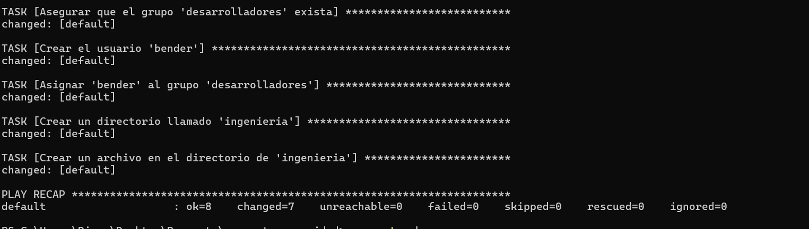
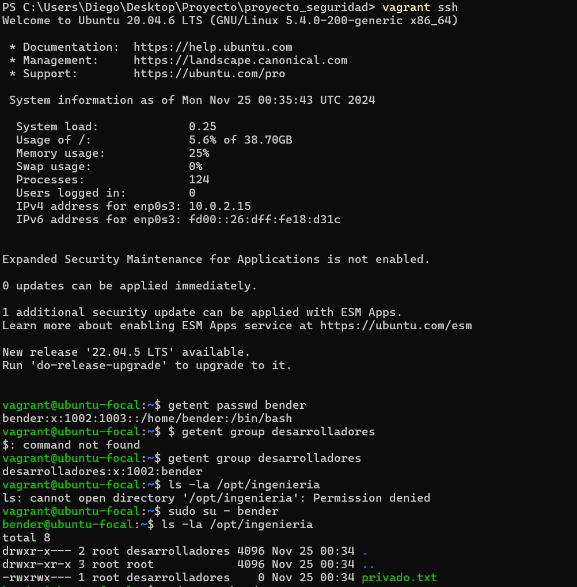
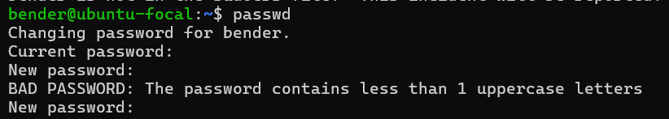
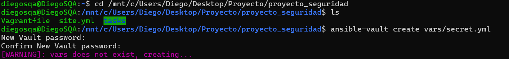
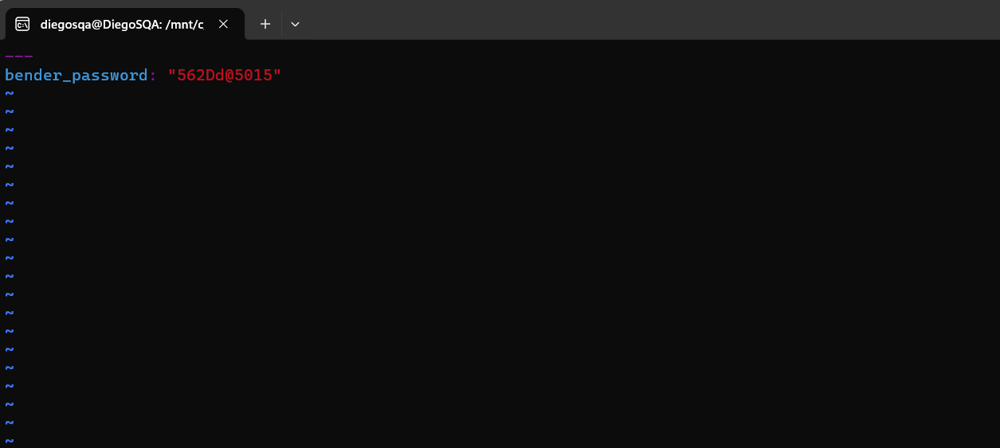

# Informe Actividad 20

Al igual que la actividad anterior, donde ya tenemos todo instalado y desplegado, ademas de la experiencia adquirida, vamos a continuar con la siguiente actividad

Aca vamos a saltarnos todo el tema de la configuración por que es bastante similar a lo que hicimos en la anterior actividad, donde si logramos configurar perfectamente el VagrantFile como el playbook.yml

Entonces vamos a pasar directamente a desplegar nuestra maquina virtual para hacer la comprobaciones

Ingresamos a nuestra maquina virtual para ejecutar los comandos indicados en el laboratorio, donde vemos que nos aparece tal cual lo que nos indica

Tambien se logro implementar la política de contraseña

