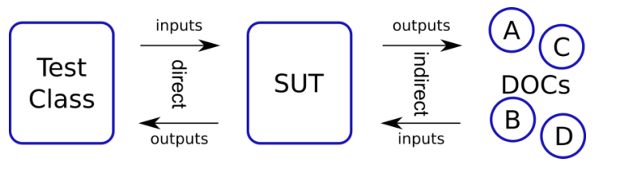
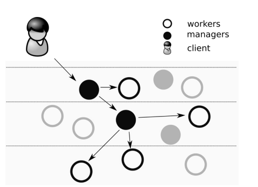

# Actividad JUnit5

## Pregunta 1
Explica el siguiente gráfico en términos de SUT y DOC para pruebas unitarias.

### Respuesta

La imagen describe un esquema típico de cómo se estructura una prueba unitaria en relación con el código que se está probando y sus dependencias externas.

1. **Test Class**: Esta es la clase que contiene los tests unitarios. Su trabajo es enviar instrucciones y datos al sistema que se está probando y luego verificar que las respuestas que recibe coincidan con lo esperado.

2. **SUT (Sistema Bajo Prueba)**: Es la sección del código que se está sometiendo a prueba. El SUT recibe entradas de la clase de test y, basado en esas entradas, ejecuta su lógica interna y luego produce una salida.

3. **DOCs (Documentos de Objetos Dependientes)**: Representan otras partes del sistema que el SUT utiliza para realizar su trabajo, como bases de datos o servicios web. El SUT puede enviar datos a estos objetos (salidas indirectas) o recibir datos de ellos (entradas).

En términos de flujo:

- La **Test Class** genera y envía datos de entrada al **SUT**.
- El **SUT** procesa estos datos y genera una salida. Algunas de estas salidas son el resultado directo de las entradas y son verificadas directamente por la Test Class.
- Otras salidas son indirectas y se reflejan en cambios o llamadas a los **DOCs**. Por ejemplo, el **SUT** puede modificar un archivo (DOC A), enviar una solicitud a un servicio web (DOC C), o incluso cambiar el estado interno de un objeto que luego afecta cómo responde a futuras entradas (DOC B y DOC D).

## Pregunta 2
Imaginemos algún servicio financiero (clase FinancialService) que, en función del último pago del cliente y su tipo (cualquiera que sea), calcula algún "bonus"

public class FinancialService {
.... // definition of fields and other methods omitted
public BigDecimal calculateBonus(long clientId, BigDecimal payment) {
Short clientType = clientDAO.getClientType(clientId);
BigDecimal bonus = calculator.calculateBonus(clientType, payment);
clientDAO.saveBonusHistory(clientId, bonus);
return bonus;
     }
}

Identifica el SUT y sus colaboradores (DOC) y describe los tipos de interacción que ocurren dentro del método calculateBonus() importantes para la prueba.

### Respuesta
El método `calculateBonus` de la clase `FinancialService` es el Sistema Bajo Prueba (SUT). 

**SUT:**
- `calculateBonus(long clientId, BigDecimal payment)`: Este es el método que vamos a probar.

**Documentos de Objetos Dependientes (DOCs):**
- `clientDAO`: Encargado de interactuar con la base de datos.
- `calculator`: Encargado de realizar el cálculo del bono.

**Interacciones:**
1. El SUT invoca `clientDAO.getClientType(clientId)` para obtener el tipo de cliente.
2. Con el tipo de cliente, el SUT llama a `calculator.calculateBonus(clientType, payment)` para calcular el bono.
3. Finalmente, el SUT llama a `clientDAO.saveBonusHistory(clientId, bonus)` para registrar el bono calculado.

Para la prueba unitaria, se simulan las respuestas de `clientDAO` y `calculator` para validar solo la lógica dentro de `FinancialService.calculateBonus`.

## Pregunta 3
¿Como crees que serían las pruebas de los trabajos y la de los gerentes? ¿ Por que preocuparse por las interacciones indirectas?

### Respuesta
El diagrama parece representar una estructura de empresa donde el cliente se comunica solo con los gerentes y estos, a su vez, se comunican con los trabajadores. Esto sugiere una jerarquía y flujo de trabajo en la que los trabajadores no interactúan directamente con el cliente.

Si imaginamos las pruebas en este contexto, podríamos pensar que para los trabajadores se centrarían en las tareas específicas que realizan, como la calidad y la eficiencia de su trabajo. Las pruebas para los gerentes, por otro lado, podrían estar más orientadas a su capacidad para gestionar y transmitir la información entre el cliente y los trabajadores, asegurando que las instrucciones del cliente se implementen correctamente.

La razón para preocuparse por las interacciones indirectas es que aunque los trabajadores no hablen directamente con el cliente, sus acciones afectan la satisfacción del cliente. Así, es crucial que la comunicación sea clara y precisa en todos los niveles. Los gerentes deben comprender las necesidades del cliente y comunicarlas eficazmente a los trabajadores, y los trabajadores deben confiar en que los gerentes les proporcionen las indicaciones precisas

## Pregunta 4
Completado

## Pregunta 5
¿Cuál es la diferencia entre una prueba unitaria y otros tipos de pruebas, como las pruebas de integración o las pruebas de aceptación¡
### Respuesta
Las pruebas unitarias se enfocan en verificar la correcta funcionalidad de componentes individuales del código, como funciones o clases, de manera aislada. Las pruebas de integración comprueban cómo esos componentes individuales trabajan juntos o con sistemas externos. Las pruebas de aceptación, en cambio, validan el software contra los requisitos del negocio para asegurarse de que cumple con las expectativas y necesidades del usuario final.